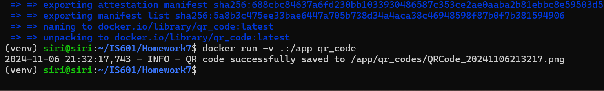

# Docker and Python

For this assignment i have created a QR code that will navigate to my home page of github account on scanning.


## Setup
1.  Goto Docker.com and Install docker - [https://www.docker.com/get-started/](here)
2.  Signup for your own Docker account 

## Submission:

1. QR code for my profile is below mentioned


2. the log of successfully creating the QR code below.




### Building the Image

```sh
docker build -t qr_code .
```
This command builds a Docker image named `qr_code` from the Dockerfile in the current directory (`.`).

### Running the Container with Default Settings
```sh
docker run -d --name qr-run qr_code
```

Runs your QR code generator application in detached mode (`-d`) with a container named `qr-run`.

### Setting Environment Variables for QR Code Customization

```sh
docker run -d --name qr-run \
  -e QR_DATA_URL='https://github.com/vt325456/' \
  -e QR_CODE_DIR='qr_codes' \
  -e QR_CODE_FILENAME='profileQR.png' \
  -e FILL_COLOR='black' \
  -e BACK_COLOR='white' \
  qr_code
```
Customizes the QR code generation settings through environment variables.

### Sharing a Volume for QR Code Output

```sh
docker run -d --name qr-run \
  -v /host/path/for/qr_codes:/app/qr_codes \
  qr_code
```
Mounts a host directory to the container for storing QR codes.

### Combining Volume Sharing and Environment Variables

```sh
docker run -d --name qr-run \
  -e QR_CODE_DIR='qr_codes' \
  -e FILL_COLOR='black' \
  -e BACK_COLOR='white' \
  -v /host/path/for/qr_codes:/app/qr_codes \
  qr_code
```

A comprehensive command that configures the QR code settings and mounts volumes for QR codes.

## Setting the arg for the url from the terminal
```sh
docker run -v .:/app qrcode --url https://github.com/vt325456/
```
This is how you would set the url for the qr code
### Basic Docker Commands Explained

**Building an Image**

```sh
docker build -t image_name .
```

Builds a Docker image with the tag `image_name` from the Dockerfile in the current directory.

**Running a Container**

```sh
docker run --name container_name image_name
```
Runs a container named `container_name` from `image_name` in the foreground / attached mode

```sh
docker run -d --name container_name image_name
```
Runs a container named `container_name` from `image_name` in detached mode

**Listing Running Containers**

```sh
docker ps
```
Shows a list of all running containers.

**Stopping a Container**

```sh
docker stop container_name
```
**Removing a Container**

```sh
docker rm container_name
```
**Listing Docker Images**


```sh
docker images
```
Lists all Docker images available on your machine.

**Removing a Docker Image**


```sh
docker rmi image_name
```

Removes a Docker image.

**Viewing Logs of a Container**

```sh
docker logs container_name
```
Displays the logs from a running or stopped container.

These commands cover the essentials of building, running, and managing Docker containers and images, along with specific examples for your QR code generation application.
